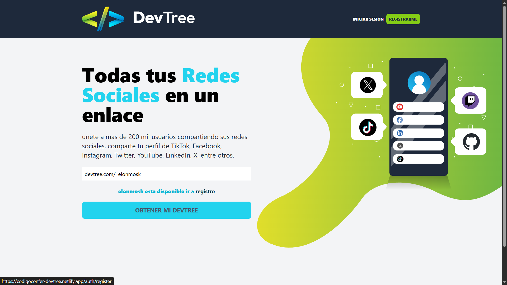

# DevTree - Developer Link Tree 🌲



**DevTree** is a full-stack platform that allows developers to create a personalized page with their social links, GitHub repositories, and contact information. It's a "Linktree" clone tailored for the developer community, featuring a drag-and-drop interface and social authentication.

🔗 \*\*[Ver Demo en Vivo](https://codigoconfer-devtree.netlify.app/) \_

---

## 🚀 Características Principales

- **Autenticación Segura:** Registro y Login JWT, validación de emails y protección de rutas.
- **Gestión de Perfil:** Personalización de handle (nombre de usuario), descripción e imagen de perfil.
- **Links Dinámicos:** Agrega enlaces a tus redes sociales (GitHub, LinkedIn, Twitter, etc.).
- **Drag & Drop:** Reordena tus links visualmente para personalizar tu página publica.
- **Búsqueda Global:** Encuentra a otros desarrolladores por su handle.
- **Diseño Responsive:** Optimizado para móviles y escritorio con una UI moderna.

## 🛠️ Stack Tecnológico

Este proyecto fue construido utilizando **MERN Stack** + TypeScript:

### Frontend

- **React.js** (Vite)
- **TypeScript**
- **Tailwind CSS** (Estilos y Diseño)
- **React Query** (Gestión de estado asíncrono)
- **React Hook Form** + Zod (Manejo de formularios)
- **Dnd Kit** (Funcionalidad Drag & Drop)
- **Zustand** (Estado global ligero)

### Backend

- **Node.js**
- **Express.js**
- **TypeScript**
- **MongoDB** (Base de datos NoSQL con Mongoose)
- **JWT** (JSON Web Tokens para seguridad)
- **Cloudinary** (Almacenamiento de imágenes)

---

## 🔧 Instalación y Configuración Local

Si deseas correr este proyecto en tu entorno local:

1.  **Clonar el repositorio**

    ```bash
    git clone https://github.com/FernandoZeballos/devtree.git
    cd devtree
    ```

2.  **Instalar dependencias**

    ```bash
    cd backend && npm install
    cd ../frontend && npm install
    ```

3.  **Configurar Variables de Entorno**
    Crea un archivo `.env` en cada carpeta (`backend` y `frontend`) basándote en los `.env.template`.

4.  **Ejecutar en Desarrollo**
    Desde la raíz (o en terminales separadas):

    ```bash
    # Backend
    cd backend
    npm run dev

    # Frontend
    cd frontend
    npm run dev
    ```

---

## ☁️ Despliegue (Deployment)

Esta aplicación está desplegada en la nube utilizando servicios modernos:

- **Frontend:** Netlify
- **Backend:** Render (Web Service)
- **Base de Datos:** MongoDB Atlas

---

## 👤 Autor

Desarrollado con ❤️ por Fernando Zeballos.

---

_Este proyecto es parte de mi portafolio como Desarrollador Full Stack._
